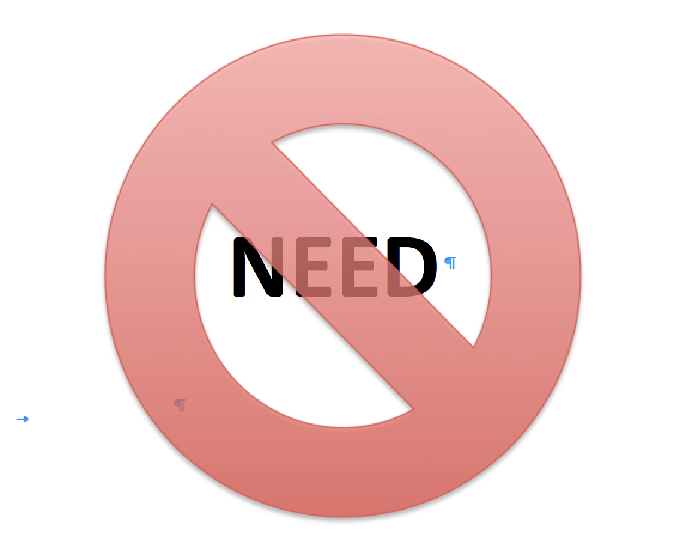

# You Don't Need
<a href="https://github.com/you-dont-need">
  </img>
</a>  

People choose popular projects, often not because it applies to their problems.  

## Contents

- [Packages](#packages)
  - [JavaScript Packages](#javascript-packages)
- [Languages](#languages)
- [Programming Practices](#programming-practices)
- [Miscellaneous](#miscellaneous)

## Packages

### JavaScript Packages

- [You don't (may not) need Lodash/Underscore](https://github.com/you-dont-need/You-Dont-Need-Lodash-Underscore) - List of JavaScript methods which you can use natively + ESLint Plugin.
- [You don't (may not) need Moment.js](https://github.com/you-dont-need/You-Dont-Need-Momentjs) - List of date-fns or native functions which you can use to replace moment.js.
- [You Might Not Need Redux](https://medium.com/@dan_abramov/you-might-not-need-redux-be46360cf367) - If you're just learning React, don't make Redux your first choice.
- [You Might Not Need React Router](https://www.freecodecamp.org/news/you-might-not-need-react-router-38673620f3d) - The majority of projects at Facebook don't even use it.
- [You Might Not Need jQuery](http://youmightnotneedjquery.com/) - If you're only targeting more modern browsers, you might not need anything more than what the browser ships with.
- [You Might Not Need Axios](https://danlevy.net/you-may-not-need-axios/) - The standard `window.fetch` has all the features you need.

## Languages

- [You Don't Need JavaScript](https://github.com/you-dont-need/You-Dont-Need-JavaScript) - CSS is powerful, you can do a lot of things without JS.
- [You Might Not Need TypeScript (or Static Types)](https://medium.com/javascript-scene/you-might-not-need-typescript-or-static-types-aa7cb670a77b#.8oxodypn7) - There's no question that static types can feel good. Biting into a hot glazed donut feels good. But is it really good for you?

## Programming Practices

- [You Don't Need Loops ➿](https://github.com/you-dont-need/You-Dont-Need-Loops) - Loops are bullshit. Let's embrace wholemeal programming!
- [You Probably Don't Need Derived State (React)](https://reactjs.org/blog/2018/06/07/you-probably-dont-need-derived-state.html) - As a general rule, derived state should be used sparingly. All problems with derived state that we have seen can be ultimately reduced to either unconditionally updating state from props or updating state whenever props and state don't match.
- [You Might Not Need to Transpile Your JavaScript](https://www.freecodecamp.org/news/you-might-not-need-to-transpile-your-javascript-4d5e0a438ca) - In other words if you're transpiling your JavaScript to ES5, you're making your code unnecessarily big and slow to support a minority of the users who will probably upgrade their system by the time you manage to configure your Webpack and Babel! 😉

## Miscellaneous

- [You Don't Need GUI](https://github.com/you-dont-need/You-Dont-Need-GUI) - Stop relying on GUI; CLI **ROCKS**.
